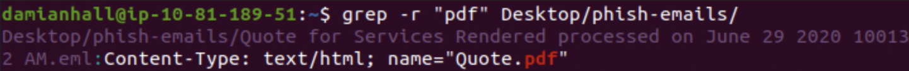
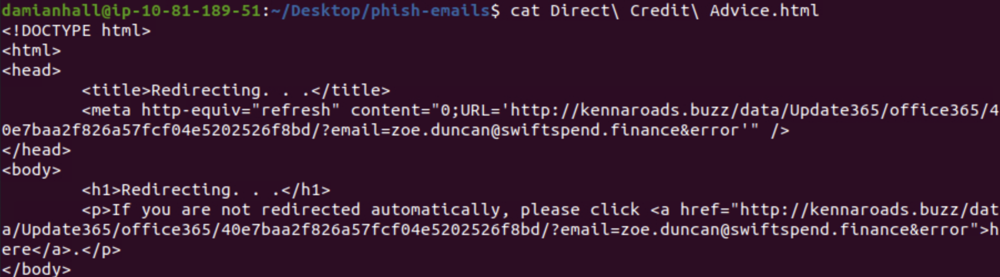
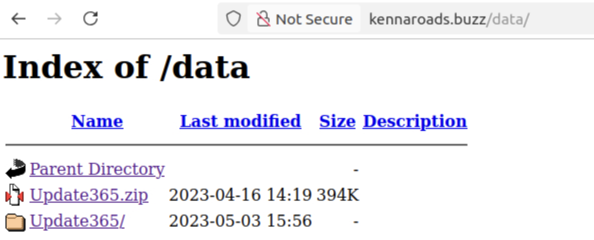
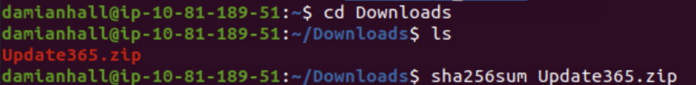
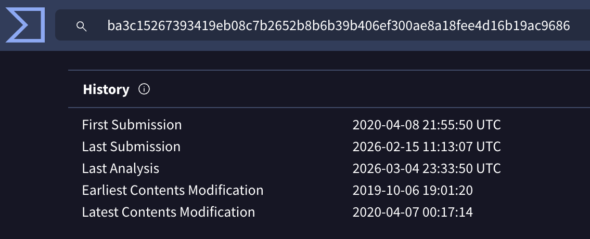
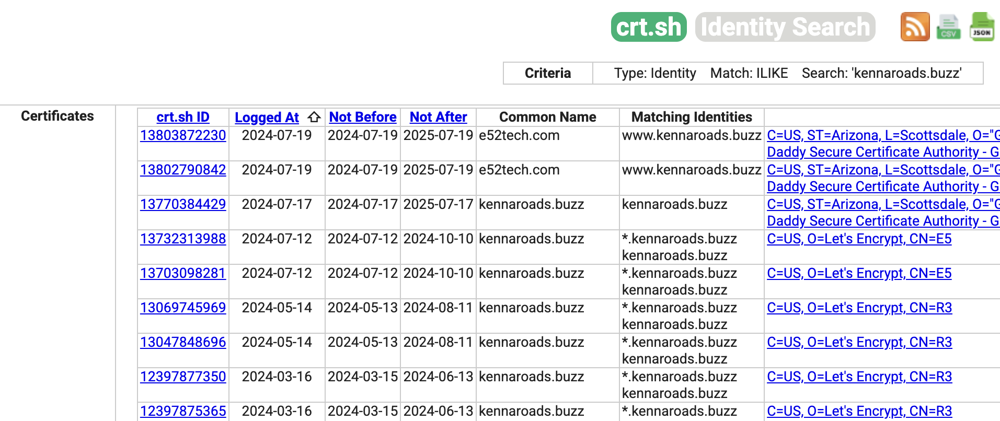
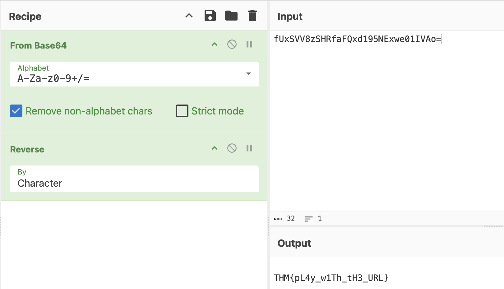

# Snapped Phishing-Line Step by Step Documentation and Answers

### 1) Who is the individual who received an email attachment containing a PDF?
By running ‘grep -r “pdf” Desktop/phish-emails’, I was able to determine which eml file contained a pdf, and by opening that file I was able to find a name.



### 2) What email address was used by the adversary to send the phishing emails? 
I simply opened the file and looked at who sent the emails. 

### 3) What is the redirection URL to the phishing page for the individual Zoe Duncan? (defanged format)
I downloaded and viewed the html code from Zoe Duncan’s email, found the redirection link, and using CyberChef, I defanged the link.



### 4) What is the URL to the .zip archive of the phishing kit? (defanged format)
I navigated to the link provided by the attachment, and by enumerating the website url, I eventually landed upon the page containing the .zip file.


### 5) What is the SHA256 hash of the phishing kit archive?
I downloaded the .zip file and ran “sha256sum Update365.zip to find the SHA256 hash of the phishing kit archive.



### 6) When was the phishing kit archive first submitted? (format: YYYY-MM-DD HH:MM:SS UTC)
Using VirusTotal and submitting the hash, I navigated to the details page and found the answer.



### 7) When was the SSL certificate the phishing domain used to host the phishing kit archive first logged? (format: YYYY-MM-DD)
I used crt[.]sh to view certificate transparency logs, scrolled down to the end to see when the phishing kit archive was first logged.



### 8) What was the email address of the user who submitted their password twice?
By enumerating the website I found log.txt which logged every credentials and I saw who sent their credentials twice.

### 9) What was the email address used by the adversary to collect compromised credentials?
After unzipping the Update365, I used grep to find a list of all emails written into the folder.

```grep -ErhoI '[a-zA-Z0-9._%+-]+@[a-zA-Z0-9.-]+\.[a-zA-Z]{2,}' | sort -u```

### 10) The adversary used other email addresses in the obtained phishing kit. What is the email address that ends in "@gmail[.]com"?
I found the answer to this question using the same method above.


### 11) What is the hidden flag?
The hint indicated the flag was hidden in the phishing domain. After enumerating the domain, I found the hidden message. Realizing it was base64 encoded,
I decoded using CyberChef and reversed the output to obtain the final flag. 



